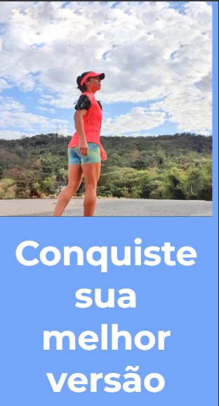

# blenda-lemos-site 💪  
*Página de apresentação da personal trainer Blenda Lemos*


---

## 📥 Instalação  

Clone o repositório:

```bash
git clone https://github.com/seu-usuario/blenda-lemos-site.git
cd blenda-lemos-site
```
---


---
# documentação 

## HTML 🌐
```html
<div class="container">
Cria uma área principal que divide o conteúdo da esquerda (imagem) e da direita (texto e botão).
```
## 🖼️ Lado esquerdo - Imagem
```html
<div class="left-side">
    
</div>
```
Mostra uma imagem da Blenda correndo.

## 📝 Lado direito - Texto e botão

```html
<div class="right-side">
    <h1>Conquiste sua melhor versão</h1>
    <p>Blenda Lemos Personal</p>
    <a href="https://wa.me/...">Agendar consulta</a>
</div>
<h1> é o título de destaque.

<p> é o subtítulo com o nome da Blenda.

<a> é um botão que leva pro WhatsApp com uma mensagem pronta pra agendar.
```

# 🎨 CSS (style.css)
O CSS é o que dá o visual bonito do site: cores, tamanhos, posições, fontes etc.

### 1. Reset e Fonte
```css
body {
    margin: 0;
    font-family: 'Montserrat', sans-serif;
}
```
- Remove margens padrões.
- Define a fonte Montserrat.

### 2. Layout Principal
```css
.container {
    display: flex;
    height: 100vh;
}
```
- display: flex divide a tela em duas partes lado a lado.

- height: 100vh faz ocupar a tela inteira do navegador.

### 3. Imagem do lado esquerdo
```css
.left-side {
    flex: 1;
}
.left-side img {
    width: 100%;
    height: 100%;
    object-fit: cover;
}
```
- flex: 1 dá metade da tela pra imagem.
- object-fit: cover faz a imagem preencher todo o espaço sem distorcer.

## 4. Texto do lado direito
```css
.right-side {
    flex: 1;
    background-color: #74a9f6;
    color: white;
    display: flex;
    flex-direction: column;
    justify-content: center;
    align-items: center;
    text-align: center;
    padding: 2rem;
}
```
- Define cor de fundo azul.

- Centraliza tudo vertical e horizontalmente.

- Usa branco como cor da fonte.

### 5. Título e Subtítulo
```css
.right-side h1 {
    font-size: 3rem;
    margin-bottom: 1rem;
}
.right-side p {
    font-size: 1.2rem;
    font-weight: bold;
    margin-bottom: 2rem;
}
```
 - Tamanhos e espaçamentos ajustados pro texto chamar atenção.

### 6. Botão de WhatsApp
```css
.right-side a {
    background-color: white;
    color: #74a9f6;
    padding: 1rem 2rem;
    text-decoration: none;
    border-radius: 5px;
    font-weight: bold;
}
```
- Botão branco com texto azul.
- Sem sublinhado (text-decoration: none).
- Arredondado e com destaque.

## 7. Responsividade (celular)

```css
@media (max-width: 768px) {
    .container {
        flex-direction: column;
    }
    .left-side,
    .right-side {
        flex: none;
        height: 50vh;
    }
    .right-side h1 {
        font-size: 2rem;
    }
}
```
- Quando a tela for menor que 768px (celular) Muda de lado a lado para uma coluna em cima da outra.

- Reduz tamanho do texto.

- Divide a tela metade imagem, metade texto.

## Uso 📱
- O site apresenta:

- Uma imagem em tela cheia da Blenda Lemos.

- Um título chamativo com chamada para ação.

- Um botão que redireciona diretamente para o WhatsApp com uma mensagem pré-definida.

.. image:: https://user-images.githubusercontent.com/your-gif-here.gif
:alt: Preview do site

📲 Totalmente responsivo: se adapta para mobile com ajustes de layout, tamanhos de texto e botão.


## Por que? 🤔
 - Criado para divulgar o trabalho da personal Blenda Lemos.

 - Oferece um contato direto e rápido com clientes.

 - Design simples, direto e visualmente atrativo.

 - Responsivo para dispositivos móveis.

## Licença ⚖️
- Este projeto é de uso pessoal.
